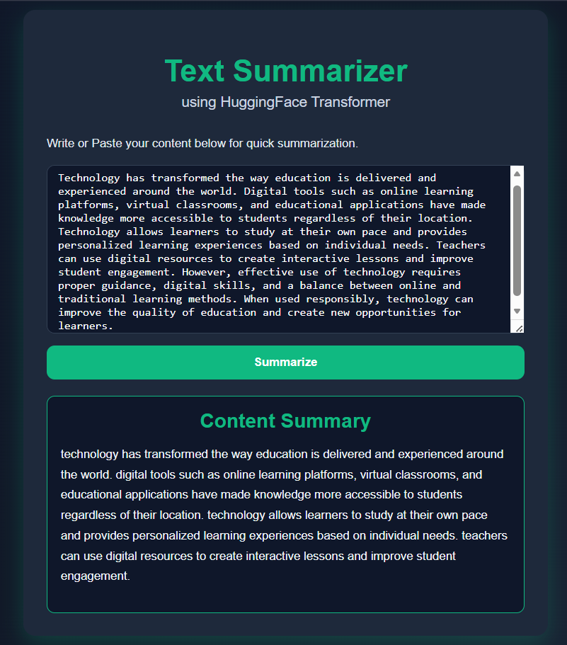

# AI Text Summarizer

## Overview

AI Text Summarizer is a Natural Language Processing (NLP) web application that generates concise summaries from long text inputs. The application uses the T5 Transformer model from Hugging Face and provides a simple web interface for users to summarize content efficiently.

The project demonstrates the use of Transformer-based deep learning models for automated text summarization.

## Features

- Summarizes long text into concise and meaningful summaries
- Built using FastAPI for backend API development
- User-friendly web interface for entering text
- Uses a pre-trained T5 Transformer model for NLP-based summarization
- Fast and efficient summary generation

## Demo Screenshot



## Model Used

This project uses the **T5 (Text-To-Text Transfer Transformer)** model for text summarization.

The model is based on the Hugging Face Transformers library and is designed to perform various NLP tasks by converting input text into a summarized output.

> **Note:** The trained model files are not included in this repository because they exceed GitHub's file size limitations. The required model can be downloaded through the Hugging Face Transformers library during execution.

## Tech Stack

- **Programming Language:** Python
- **Backend Framework:** FastAPI
- **Deep Learning Framework:** PyTorch
- **NLP Model:** Hugging Face Transformers (T5)
- **Frontend:** HTML/CSS/JavaScript

## How It Works

1. User enters a long piece of text through the web interface.
2. The text is sent to the FastAPI backend.
3. The T5 Transformer model processes the input using NLP techniques.
4. The model generates a concise summary.
5. The summarized output is displayed to the user.

## Project Structure

```text
TextSummarizerApp/
│
├── app.py
├── requirements.txt
├── screenshots/
│   └── text-summarizer-demo.png
├── templates/
│   └── index.html
├── README.md
└── .gitignore

```
## How to Run

Follow these steps to run the application locally:

### 1. Clone the Repository

```bash
git clone <your-github-repository-link>
2. Navigate to the Project Directory
cd TextSummarizerApp
3. Install Dependencies
pip install -r requirements.txt
4. Start the FastAPI Server
uvicorn app:app --reload
5. Open the Application
After successfully starting the FastAPI server, a local URL will be displayed in the terminal.

Open the provided URL in your web browser to access the AI Text Summarizer application.


## Author

**Kamini Uniyal**

GitHub: [@kamini-uniyal](https://github.com/kamini-uniyal)